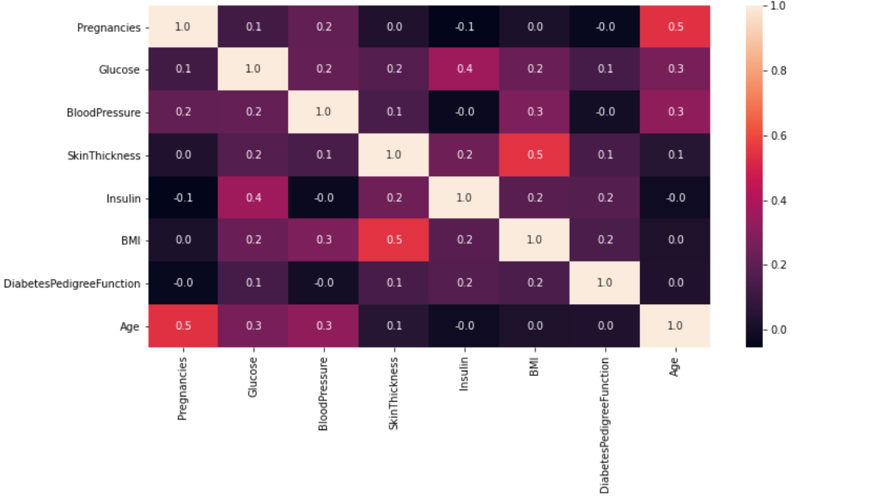
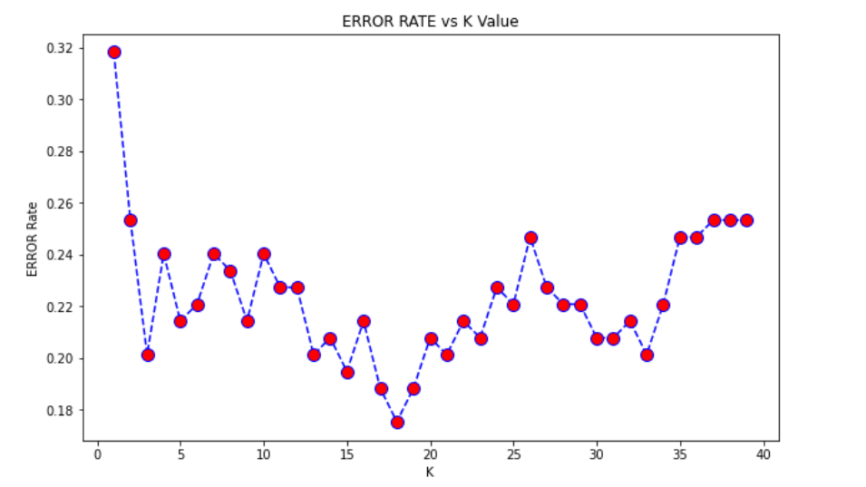
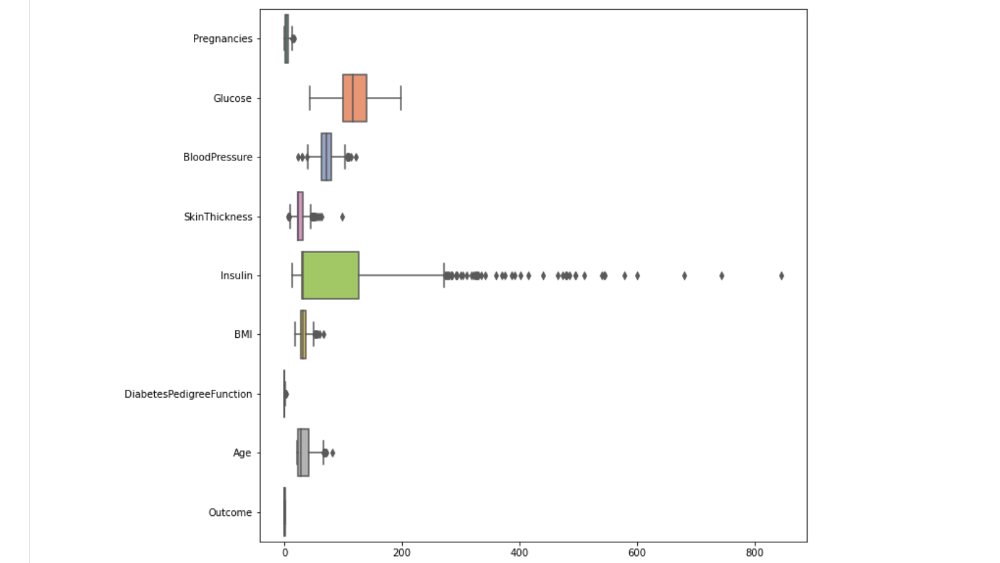
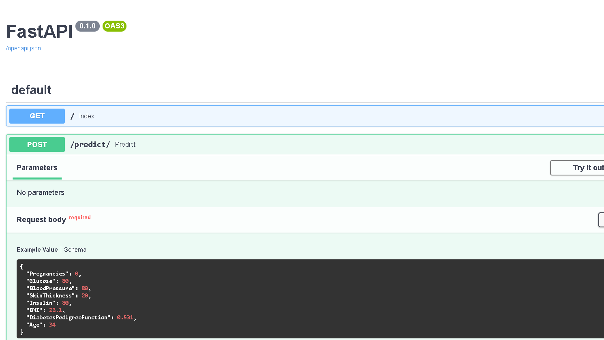
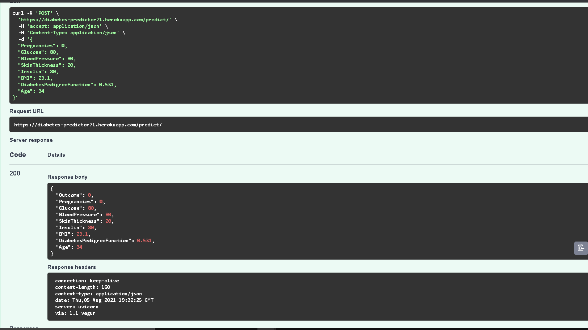

<h1> PIMA-INDIANS-DIABETES-PREDICTOR </h1>

## PROBLEM STATEMENT  
<p><strong>This dataset is originally from the National Institute of Diabetes and Digestive and Kidney Diseases.</strong></p>
<p>The objective of the dataset is to diagnostically predict whether or not a patient has diabetes, based on certain diagnostic measurements included in the dataset.
Several constraints were placed on the selection of these instances from a larger database.
In particular, all patients here are females at least 21 years old of Pima Indian heritage.The dataset consists of several medical predictor variables and one target variable, Outcome.
Predictor variables includes the number of pregnancies the patient has had, their BMI, insulin level, age, and so on.</p>

#### 
[Download Dataset](https://www.kaggle.com/uciml/pima-indians-diabetes-database) 


## DISCUSSION 
In this dataset, NaN values were in the form of zeros so I replaced them with median because it is more resistant towards outliers.Then I have done some visualizations.I scaled up
all the features.This is a classification problem so I used Logistics Regression, Support Vector Machines(SVM), K-nearest neighbors(KNN), Decision Tree, Random Forest. Out of five, the
best accuracy score and least error is given by KNN model and then I applied Hyperparameter Tunning to improve the performance of the model. I applied GridSearchCV on KNN and RandomisedSearchCV
on Random Forest and lastly find out that KNN is giving the best prediction among all on this dataset.

````
 LogisticRegression :0.7857142857142857 
 SVC : 0.7922077922077922
 KNN : 0.8116883116883117
 Decision Tree: 0.6948051948051948
 Random Forest: 0.7922077922077922
 ````

### Some Visualizations








## Files
```
- main.py : This file contains all the routes
- schemas.py : Contains structure of model
- model/Diabetes Prediction.ipynb : Jupyter Notebook with all the workings including visualization, pre-processing, modelling.
- model/model.pkl : Trained model pickle file
- model/scale.pkl : Scaler object pickle file
- requirements.txt : pre-requiste libraries for the project
```
#### Requirements:
 - 
 - 
 - 
 - 
 - 
 - 
            

## FASTAPI
<p align="center">
  <a href="https://fastapi.tiangolo.com"></a>
</p>
<p align="center">
    <em>FastAPI framework, high performance, easy to learn, fast to code, ready for production</em>

---

**Documentation**: <a href="https://fastapi.tiangolo.com" target="_blank">https://fastapi.tiangolo.com</a>

---

FastAPI is a modern, fast (high-performance), web framework for building APIs with Python 3.6+ based on standard Python type hints.

The key features are:

* **Fast**: Very high performance, on par with **NodeJS** and **Go** (thanks to Starlette and Pydantic). [One of the fastest Python frameworks available](#performance).

* **Fast to code**: Increase the speed to develop features by about 200% to 300%.
* **Fewer bugs**: Reduce about 40% of human (developer) induced errors.
* **Intuitive**: Great editor support. <abbr title="also known as auto-complete, autocompletion, IntelliSense">Completion</abbr> everywhere. Less time debugging.
* **Easy**: Designed to be easy to use and learn. Less time reading docs.
* **Short**: Minimize code duplication. Multiple features from each parameter declaration. Fewer bugs.
* **Robust**: Get production-ready code. With automatic interactive documentation.
* **Standards-based**: Based on (and fully compatible with) the open standards for APIs: <a href="https://github.com/OAI/OpenAPI-Specification" class="external-link" target="_blank">OpenAPI</a> (previously known as Swagger) and <a href="https://json-schema.org/" class="external-link" target="_blank">JSON Schema</a>.


### Interactive API docs

Now go to <a href="http://127.0.0.1:8000/docs" class="external-link" target="_blank">http://127.0.0.1:8000/docs</a>.

You will see the automatic interactive API documentation (provided by <a href="https://github.com/swagger-api/swagger-ui" class="external-link" target="_blank">Swagger UI</a>):


</br>


### Deployment to Heroku 

The Heroku Command Line Interface (CLI) makes it easy to create and manage your Heroku apps directly from the terminal. It’s an essential part of using Heroku install it.
Then refer to the documentation to see all the necessary commands : https://devcenter.heroku.com/


### Getting started?
- Clone/pull/download this repository
- Create a virtualenv with virtualenv env and install dependencies with pip install -r requirements.txt
- Make meaningful changes and Create Pull request

Drop a ⭐ on the Github Repository.


